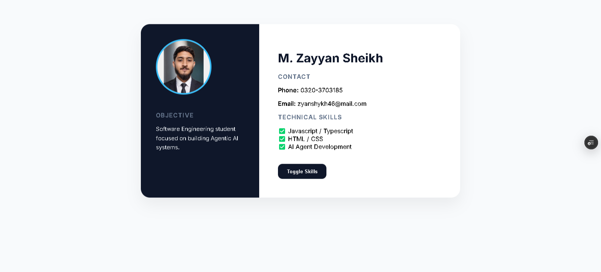

# Milestone-1: Static Resume

A clean, responsive, and interactive static resume project built as part of the web development milestones.

---

## ✍️ Author
* **Zayan Sheikh** - [@zyanshykh](https://github.com/zyanshykh)

---

## 📖 About This Project
This project is a modern digital resume designed to showcase core web development skills. It features:
* **Semantic HTML5** - For a structured and accessible layout.
* **Custom CSS3** - For clean typography, color schemes, and responsiveness.
* **TypeScript / JavaScript** - Adding interactive elements and dynamic functionality.

---

## 🛠️ Project Structure
Here is how the project files are organized:
* `web.html` - The main structure of the resume.
* `style.css` - Custom styling and layout rules.
* `script.ts` / `script.js` - Logic for dynamic interactions.
* `profile.jpeg` - Profile picture asset.

---

## 💻 Tech-Stack
* **HTML5**
* **CSS3**
* **TypeScript**
* **JavaScript**

---

## 📄 License
This project is open-source and available under the [MIT License](https://opensource.org/licenses/MIT).
